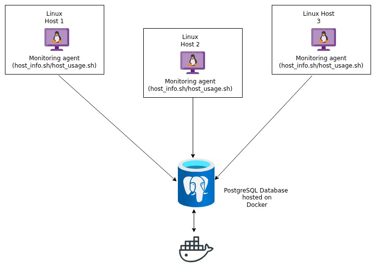

# Linux Cluster Monitoring Agent


## Introduction
This project sets up a local PostgreSQL database using Docker and defines a structured schema to store Linux server hardware details and ongoing resource usage metrics. It uses Bash scripts and the psql CLI to initialize the database, insert data, and automate data collection. A one-time script captures static host information, while a scheduled script runs every minute via crontab to record live system usage into the database. Together, these components form a simple, automated monitoring system that allows administrators to analyze server performance over time using SQL.
## Quick Start

To deploy this project run

```bash
 # Start PostgreSQL using Docker
./scripts/psql_docker.sh start postgres password

# Create database tables
psql -h localhost -U postgres -d host_agent -f sql/ddl.sql

# Insert host hardware information (run once per host)
./scripts/host_info.sh localhost 5432 host_agent postgres password

# Insert host usage metrics (can be run manually)
./scripts/host_usage.sh localhost 5432 host_agent postgres password

# Set up cron job
crontab -e
```


## Implementation

The project uses an agent-style approach where each Linux server runs two Bash scripts. One script records the host’s hardware details in the database, while the other continuously logs system performance metrics at regular intervals. All data is saved in a central PostgreSQL database deployed within a Docker container. The periodic data collection is automated using cron, which schedules the usage script to execute consistently over time.

## Architecture

## Scripts

The project uses several Bash scripts to deploy the database, collect system metrics, and support monitoring and analysis.


## psql_docker.sh
This script handles the PostgreSQL database via Docker, managing the start and stop of the database container and making sure the database service is running and ready to receive metric data.


```bash
 create a psql docker container with the given username and password.
./scripts/psql_docker.sh create db_username db_password
./scripts/psql_docker.sh start
./scripts/psql_docker.sh stop
```
## host_info.sh

This script collects static hardware information from the host, such as CPU details and total memory, and inserts it into the host_info table.

```bash
 ./scripts/host_info.sh psql_host psql_port db_name psql_user psql_password
```

## host_usag.sh

This script collects runtime system usage data, including free memory, CPU activity, and disk availability, and inserts it into the host_usage table.

```bash
 ./scripts/host_usage.sh psql_host psql_port db_name psql_user psql_password
```

## crontab
The host_usage.sh script is set up with cron to execute at regular intervals, such as every minute, allowing automated and continuous recording of host resource usage data.


## Database Modeling

The database host_agent consists of two tables, host_info and host_usage.

The host_info table contains the static hardware and system details for each Linux host. 

| Column             | Decription                                                                |
| ----------------- | ------------------------------------------------------------------ |
|    id | Unique identifier for each host
| hostname | Fully qualified domain name
| cpu_number | Number of CPU cores|
| cpu_architecture | CPU architecture
| cpu_model | CPU model name|
| cpu_mhz |  CPU clock speed |
|  l2_cache | L2 cache size|
| total_mem | Total memory in MB
| timestamp|  Record creation time (UTC) |


The host_usage table keeps track of time-based resource usage metrics for each host, allowing multiple records per host to be stored over time.

| Column             | Decription                                                                |
| ----------------- | ------------------------------------------------------------------ |
|    timestamp | Time when the usage snapshot was collectedd
| host_id | Reference to the corresponding host
| memory_free |  Available memory at collection time|
| cpu_idle | CPU idle percentage
| cpu_kernel| CPU kernel usage packet|
| disk_io |  Disk I/O activity |
|  disk_available | Avaiable Disk space|


# Test 

The project was tested by executing each script manually and confirming that data was correctly inserted into the database using SELECT queries. The database schema was verified by running the DDL script and ensuring that all necessary tables and constraints were created as expected. The cron job was tested by monitoring the database over several minutes to confirm that new usage records were being added automatically at the scheduled intervals.


# Deployment

The app uses Git for version control, Docker to run PostgreSQL, and cron to automate data collection. The database runs in a Docker container, while the monitoring scripts are installed on each Linux host. host_usage.sh is scheduled with cron to run at regular intervals, continuously recording system metrics.


# Improvements

 - Add a dashboard to visualize server metrics in real time.

- Optimize scripts to reduce system overhead during data collection.

- Implement alerting when CPU, memory, or disk usage exceeds thresholds.


